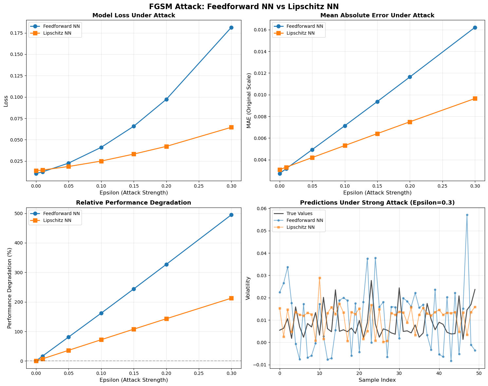

# Lipschitz Neural Networks for Robust Volatility Forecasting
### An Adversarial Robustness Study on SPY Daily Data

---

## Abstract

Standard feedforward neural networks are powerful function approximators but are known to be sensitive to small input perturbations — a vulnerability with serious implications in financial applications where data quality and market microstructure noise are ongoing concerns. This report investigates whether enforcing a **global Lipschitz constraint** on a neural network improves its robustness to adversarial perturbations in a financial time-series setting.

Two models are trained to predict the **realized volatility** of the SPY ETF (S&P 500): a standard Feedforward Neural Network (FNN) and a Lipschitz-constrained Neural Network (LNN). Both are then subjected to **Fast Gradient Sign Method (FGSM)** attacks of increasing strength. The Lipschitz-constrained model demonstrates approximately **2.3x better robustness** at maximum attack strength, with a performance degradation of 212% vs 493% for the standard model — a result consistent with the theoretical guarantees of Lipschitz regularity.

---

## Table of Contents

1. [Motivation](#1-motivation)
2. [Background & Theory](#2-background--theory)
3. [Data](#3-data)
4. [Model Architectures](#4-model-architectures)
5. [Adversarial Attack Framework](#5-adversarial-attack-framework)
6. [Results & Discussion](#6-results--discussion)
7. [Critical Analysis & Limitations](#7-critical-analysis--limitations)
8. [Future Work](#8-future-work)
9. [References](#9-references)

---

## 1. Motivation

Financial time series models face two overlapping challenges: **predictive accuracy** under noisy, non-stationary conditions, and **stability** in the face of distributional shifts or corrupted inputs. In practice, these disturbances can arise from:

- Data quality issues (stale prices, erroneous ticks)
- Execution noise and market microstructure effects
- Distributional shift between training and deployment regimes
- Deliberate manipulation in adversarial settings

Standard deep learning models — despite their expressive power — offer no formal guarantees on output stability. A small perturbation in the input can lead to an arbitrarily large change in the output. This property is directly captured by the **Lipschitz constant** of the network.

A function $f$ is $K$-Lipschitz if for all inputs $x_1, x_2$:

$$\| f(x_1) - f(x_2) \| \leq K \cdot \| x_1 - x_2 \|$$

A lower $K$ means the model is more stable: small input changes produce bounded output changes. This project asks — can we train a neural network with a controlled Lipschitz constant without sacrificing too much predictive accuracy?

---

## 2. Background & Theory

### 2.1 Lipschitz Continuity in Neural Networks

The Lipschitz constant of a neural network is determined by the composition of its layers. For a network $f = f_L \circ \cdots \circ f_1$, the global constant is bounded by:

$$K_f \leq \prod_{i=1}^{L} K_{f_i}$$

Controlling each layer's Lipschitz constant therefore controls the whole network. For a linear layer $x \mapsto Wx + b$, the Lipschitz constant equals the **spectral norm** of $W$, i.e. its largest singular value $\sigma_{\max}(W)$.

### 2.2 Spectral Normalization

To enforce a per-layer Lipschitz constant $\lambda$, we rescale the weight matrix at each forward pass:

$$\tilde{W} = \lambda \cdot \frac{W}{\sigma_{\max}(W)}$$

Computing $\sigma_{\max}(W)$ exactly via SVD is expensive. Instead, it is approximated via **Power Iteration**: starting from unit vectors $u \in \mathbb{R}^{m}$, $v \in \mathbb{R}^{n}$, we iteratively apply:

$$u \leftarrow \frac{Wv}{\|Wv\|}, \qquad v \leftarrow \frac{W^\top u}{\|W^\top u\|}$$

After convergence, $\sigma_{\max}(W) \approx u^\top W v$. In practice, even **1–5 iterations** per training step suffices (Miyato et al., 2018).

### 2.3 GroupSort Activation

The choice of activation function is critical for maintaining tight Lipschitz bounds. ReLU is 1-Lipschitz but is **not gradient-norm-preserving**: it zeroes out half the gradient on average, meaning the effective Lipschitz constant of the network can be much smaller than the product of layer constants, loosening the bound.

**GroupSort** avoids this by sorting input elements within fixed-size groups of size $g$ in descending order. Formally, for a group $z \in \mathbb{R}^g$:

$$\text{GroupSort}(z) = \text{sort}(z, \text{descending})$$

GroupSort is:
- **1-Lipschitz** (permutations are isometries)
- **Gradient-norm-preserving** (no values are zeroed out)
- A generalization of MaxMin activation (special case: $g = 2$)

This makes the product bound $K_f \leq \prod_i \lambda_i$ tight, giving the Lipschitz NN a genuine, certifiable regularity guarantee.

### 2.4 Garman-Klass Volatility Estimator

The prediction target is **realized volatility** estimated via the Garman-Klass estimator, a range-based estimator more efficient than the standard close-to-close variance:

$$\hat{\sigma}^2_{GK} = 0.5 \cdot \ln\!\left(\frac{H}{L}\right)^2 - (2\ln 2 - 1) \cdot \ln\!\left(\frac{C}{O}\right)^2$$

where $O, H, L, C$ denote daily Open, High, Low, and Close prices respectively. This estimator uses the full daily price range, making it significantly more data-efficient while remaining unbiased under geometric Brownian motion assumptions.

---

## 3. Data

| Property | Value |
|---|---|
| Asset | SPY ETF (S&P 500 proxy) |
| Frequency | Daily OHLCV |
| Target | Garman-Klass realized volatility |
| Normalization | MinMaxScaler (fitted on train set) |

Data is split into training and validation sets chronologically (no shuffling) to respect the temporal dependency structure of financial time series and avoid look-ahead bias.

---

## 4. Model Architectures

### 4.1 Feedforward Neural Network (Baseline)

```
Input(21) -> Linear(64) -> ReLU -> Linear(32) -> ReLU -> Linear(1)
```

A standard 3-layer MLP. No constraints are imposed on the weight matrices. Used as the robustness baseline.

### 4.2 Lipschitz Neural Network

```
Input(21) -> [SpectralNormLinear(64) -> GroupSort] -> [SpectralNormLinear(32) -> GroupSort] -> SpectralNormLinear(1)
```

| Hyperparameter | Value |
|---|---|
| Hidden dimensions | [64, 32] |
| Lipschitz constant $\lambda$ | 0.5 per layer |
| Power iteration steps | 10 |
| GroupSort group size | 2 |

With $\lambda = 0.5$ per layer and 3 linear layers, the global Lipschitz bound is $K_f \leq 0.5^3 = 0.125$ — a substantial regularity constraint.

Both models are trained with **MSE loss** and the **Adam optimizer**.

---

## 5. Adversarial Attack Framework

### 5.1 Fast Gradient Sign Method (FGSM)

FGSM (Goodfellow et al., 2014) generates adversarial examples by perturbing inputs in the direction that most increases the loss:

$$x_{adv} = x + \epsilon \cdot \text{sign}\!\left(\nabla_x \mathcal{L}(\theta, x, y)\right)$$

The perturbation budget $\epsilon$ directly controls attack strength. In this regression setting, $\mathcal{L}$ is the MSE loss.

### 5.2 Evaluation Protocol

Models are evaluated at $\epsilon \in \{0.0, 0.01, 0.05, 0.10, 0.15, 0.20, 0.30\}$. For each $\epsilon$:

1. FGSM perturbations are generated with the model in **train mode** (to enable gradient flow through BatchNorm/Dropout layers, if any)
2. Perturbed inputs are passed through the model in **eval mode**
3. Metrics (MSE loss, MAE in original scale) are computed and aggregated over the full validation set

Performance degradation is expressed relative to the clean baseline:

$$\text{Degradation}(\epsilon) = \frac{\text{MAE}(\epsilon) - \text{MAE}(0)}{\text{MAE}(0)} \times 100\%$$

---

## 6. Results & Discussion



### 6.1 Quantitative Summary

| $\epsilon$ | FNN Loss | LNN Loss | FNN MAE | LNN MAE |
|---|---|---|---|---|
| 0.00 (clean) | **0.010** | 0.013 | **0.0027** | 0.0031 |
| 0.05 | 0.023 | **0.019** | 0.0049 | **0.0042** |
| 0.10 | 0.041 | **0.025** | 0.0071 | **0.0053** |
| 0.20 | 0.097 | **0.042** | 0.0117 | **0.0075** |
| 0.30 | 0.181 | **0.064** | 0.0162 | **0.0096** |

### 6.2 Discussion

**Clean performance.** On unperturbed data, the FNN achieves a slightly lower MAE (0.0027 vs 0.0031). This is expected: the Lipschitz constraint deliberately limits the model's capacity, creating a mild accuracy-robustness trade-off on clean data. The gap is small (19%) and acceptable given the stability gains.

**Under attack.** As $\epsilon$ increases, the FNN's loss degrades sharply and non-linearly, reaching 493% degradation at $\epsilon = 0.30$. The LNN degrades far more smoothly (212%), consistent with its bounded Lipschitz constant — input perturbations of magnitude $\epsilon$ can cause at most $K_f \cdot \epsilon$ change in the output.

**Prediction quality under attack.** The bottom-right panel is particularly revealing: at $\epsilon = 0.30$, FNN predictions are erratic and frequently negative (physically impossible for volatility), while LNN predictions remain closer to the true values and preserve the sign and magnitude structure of the target.

**Crossover point.** Interestingly, around $\epsilon = 0.05$, the LNN already surpasses the FNN in absolute MAE — meaning the Lipschitz model becomes the *better* predictor even in terms of raw accuracy once any meaningful noise is present. This is a practically relevant result: real financial data always contains noise.

---

## 7. Critical Analysis & Limitations

### 7.1 The Accuracy-Robustness Trade-off

The Lipschitz constraint acts as a form of regularization. While it provably bounds sensitivity, it also limits the function class the model can represent. In high-signal, low-noise regimes, this can reduce predictive performance. The hyperparameter $\lambda$ (per-layer Lipschitz constant) is the key lever governing this trade-off and requires careful tuning — a grid search or Bayesian optimization over $\lambda$ would be more principled than manual selection.

### 7.2 FGSM Is a White-Box Attack

FGSM assumes full access to the model's gradients. In realistic financial settings, an adversary rarely has this access. The robustness demonstrated here is therefore a **worst-case bound** — real-world robustness to noise or data quality issues is likely better. Conversely, more sophisticated attacks (PGD, C&W) would likely close the gap between the two models.

### 7.3 Stationarity and Regime Changes

Both models are trained and evaluated on a single historical SPY dataset. Financial time series are notoriously non-stationary: volatility regimes shift, correlations break down, and the data-generating process evolves over time. The robustness improvement shown here may not generalize across market regimes (e.g., a 2008-style crisis vs. a low-volatility bull market). Walk-forward validation would be a more rigorous evaluation protocol.

### 7.4 Power Iteration Approximation

The spectral norm is estimated with a finite number of power iterations (10 in this implementation). While this is generally sufficient for training stability, it means the Lipschitz bound is not *exactly* $\lambda^L$ but only approximately so. In safety-critical applications, exact SVD computation or certified bounds (e.g., via SDP relaxations) would be required.

### 7.5 Single-Asset, Single-Target Setting

The experiment is conducted on a single asset (SPY) with a single target variable. Generalizing to multi-asset portfolios, where cross-asset correlations matter, or to other financial tasks (returns prediction, risk metrics) requires further validation.

---

## 8. Future Work

**Tighter Lipschitz certification.** Power iteration approximates the spectral norm during training efficiently, but introduces a small error in the Lipschitz bound. A first step would be to run an exact SVD once post-training on the frozen weights to obtain a precise certified bound — at no training cost. For stricter guarantees, SDP-based methods (e.g. LipSDP, Fazlyab et al. 2019) formulate certification as a convex optimization problem that treats the full network jointly rather than layer-by-layer, yielding tighter bounds than the product $\prod_i \lambda_i$ which can be overly pessimistic in practice.

**Learnable activation functions.** Ducotterd (2024) proposes learning the activation function jointly with the weights while preserving the Lipschitz constraint. This could recover some of the clean-data accuracy lost by the fixed GroupSort activation.

**Stronger adversarial training.** Combine Lipschitz constraints with adversarial training (PGD-based) for a dual defense strategy — structural robustness via the architecture plus empirical robustness via the training objective.

**Walk-forward backtesting.** Evaluate both models under a proper walk-forward validation scheme across multiple market regimes (2008 crisis, COVID crash, low-vol periods) to assess temporal generalization.

**Recurrent architecture.** Extend the Lipschitz framework to sequence models (Lipschitz-constrained RNNs or Transformers) to better capture the temporal dependencies inherent in financial time series.

**Uncertainty quantification.** Lipschitz networks are well-suited for conformal prediction, since the bounded sensitivity enables tighter prediction intervals. Integrating conformal coverage guarantees would add practical value for risk management.

---

## 9. References

- **Miyato et al.** (2018): *Spectral Normalization for Generative Adversarial Networks*. ICLR 2018.
- **Goodfellow et al.** (2014): *Explaining and Harnessing Adversarial Examples*. ICLR 2015.
- **Béthune et al.** (2022): *Pay attention to your loss: understanding misconceptions about 1-Lipschitz neural networks*. NeurIPS 2022.
- **Ducotterd** (2024): *Improving Lipschitz-Constrained Neural Networks by Learning Activation Functions*.
- **Boissin** (2020): *Building Lipschitz constrained networks with DEEL-LIP*.
- **Garman & Klass** (1980): *On the Estimation of Security Price Volatilities from Historical Data*. Journal of Business.
- **Cosgrove** (2018): *Spectral Normalization Explained*.
